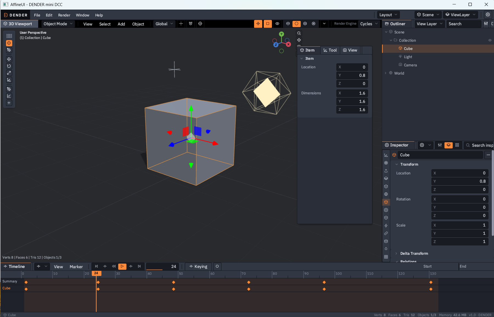
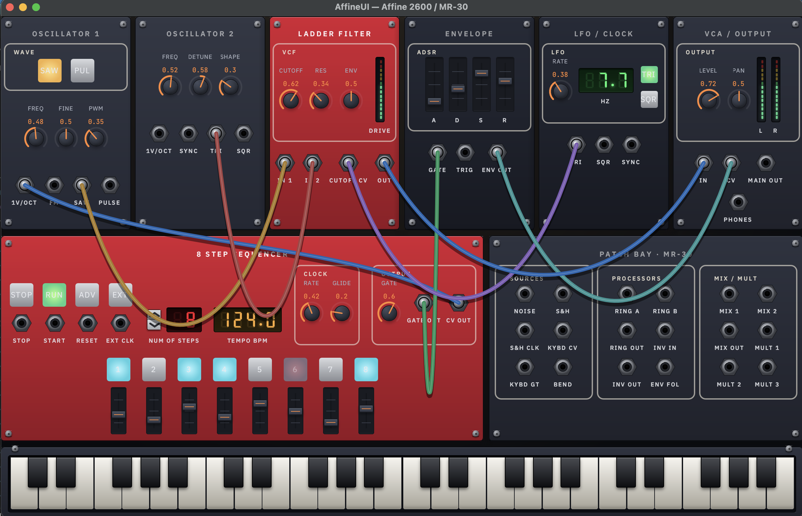
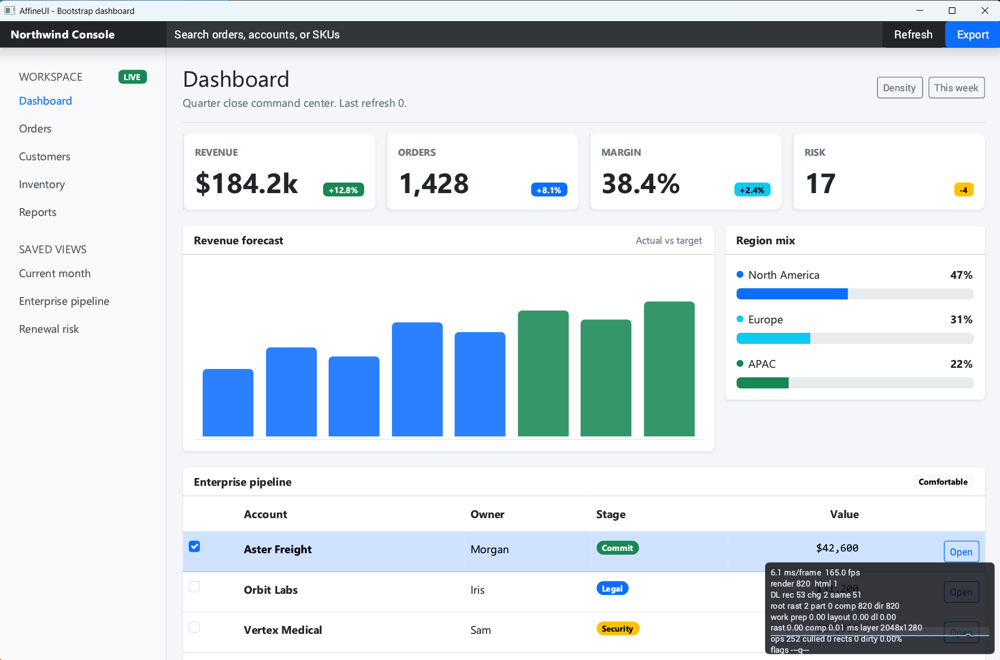
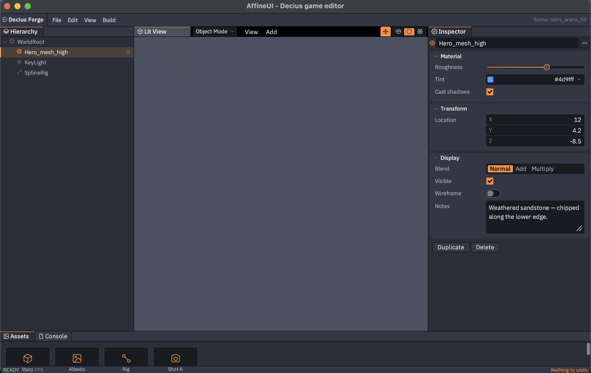
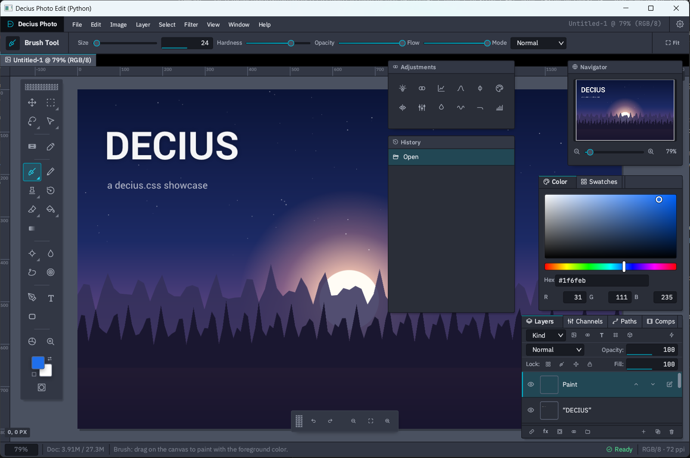

<p align="center">
  <sub>
    <b>Read this in:</b>
    <a href="README.md">English</a> ·
    <a href="docs/zh-CN/README.md">中文</a> ·
    <a href="docs/es/README.md">Español</a> ·
    <a href="docs/hi/README.md">हिन्दी</a> ·
    <a href="docs/ar/README.md">العربية</a> ·
    <a href="docs/pt-BR/README.md">Português&nbsp;(BR)</a> ·
    <a href="docs/ru/README.md">Русский</a> ·
    <a href="docs/ja/README.md">日本語</a> ·
    <a href="docs/ko/README.md">한국어</a> ·
    <a href="docs/fr/README.md">Français</a> ·
    <a href="docs/de/README.md">Deutsch</a> ·
    <a href="docs/id/README.md">Indonesia</a>
  </sub>
</p>

# AffineUI

**A small, HTML5-compliant, GPU-accelerated UI renderer with an integrated
component framework — a native replacement for Electron and Qt. Written in C++ as 
a two file no-dep header/cpp lib.**



*Dender — a 3D-print slicer showing AffineUI's default Decius CSS look. Docked panels, a custom viewport, and a full-app layout, all rendered natively.*

AffineUI ships a real browser-style HTML/CSS layout and paint engine as a
two-file C++ drop-in, a Python library (Gradio-style), a Rust crate, and a
C# NuGet package. One renderer, one component API, four host languages.
It runs at 120 Hz, is about 1MB in optimized code, animates smoothly, and 
does not embed a browser, a JavaScript VM, or a large framework.

It's built for:

- **Game tools and in-game UI** — launchers, HUDs, settings screens, debug
  panels, editor overlays.
- **DCC-style content tools** — Maya / Blender / ZBrush / DaVinci Pro-class
  applications with dense native UIs.
- **Qt / Electron replacement** — when you want the HTML/CSS authoring model
  but not the browser or the runtime bloat.
- **Anyone shipping a small, cross-platform native UI** that needs to look
  designed, not thrown together.

**It drops into an existing project and just works.** If you already have an
SDL2 or sokol_app application, adding AffineUI is two files and a wire-up
call — no build-system fork, no runtime download, no separate window.
Include, load, render, done.



*A skeuomorphic modular synth demo — everything on screen is standard HTML + CSS: knobs, cables, panel textures, animations. No custom widget toolkit, no plugins.*

---

## What AffineUI is *not*

- **Not a web browser.** No navigation, no cookies, no
  `fetch` / `XMLHttpRequest`, no window management. The goal is to be as
  small and fast as native UI can be — every feature that would grow it
  toward "browser" is out of scope on purpose.
- **Not a nerfed HTML5.** AffineUI aims at *real* HTML5 coverage, not a
  minimal subset. If a non-esoteric HTML5 or CSS feature that
  Bootstrap-, Tailwind-, or Ant-class frameworks depend on doesn't
  render correctly, treat it as a bug and file it. The gaps are
  incompleteness, not intent.
- **Not a security sandbox.** AffineUI is meant to render *your* HTML
  and *your* CSS. **Never** feed it untrusted markup, stylesheets, or
  scripts downloaded from the open web. There is no origin model, no
  CSP, no isolation between the UI and the host process.
- **Not an everything-included framework.** AffineUI renders UI. It
  does not do `<video>` decoding, GPU-driven animation of arbitrary
  scenes, 3D, audio, networking, or asset management. Those are your
  application's job — AffineUI is what you point them *at*.
- **Not (yet) a JS-based native web runtime.** By default, AffineUI
  does not run JavaScript — this is a deliberate choice for the current
  release to keep the story simple and the binary small. JS + React
  support is on the roadmap and will land as an opt-in extension,
  making AffineUI a first-class Electron replacement for teams that
  want to keep their web-app codebase.

---

## Status

**Alpha.** The core renderer, layout, cascade, and reconciler are usable
for real UIs today — Bootstrap dashboards, custom DCC layouts, and full
tool UIs all render. Standards coverage is broad but incomplete, edge
cases exist, and some CSS features are still landing. Expect bugs.
Expect to file bugs. Do not ship it to customers yet.

---

## Install

Pick your language. All four bindings sit on the same C++ core.

**Python** — like Gradio, but native:

```bash
pip install affineui
```

**Rust:**

```bash
cargo add affineui
```

**C#:**

```bash
dotnet add package AffineUI
```

**C++ (drop-in, zero dependencies):** grab the two files
[`dist/affineui.h`](dist/affineui.h) and [`dist/affineui.cpp`](dist/affineui.cpp),
add them to your project, and compile `affineui.cpp` once as C++20.
That's the entire SDK — no package manager, no submodule tree, no DLL.

Supported platforms: Windows, macOS, Linux, iOS, Android, WebGL. See
[docs/BUILDING.md](docs/BUILDING.md) for platform-specific notes and
prerequisites for building from source.

---

## Hello, world

Two flavors ship in every language:

- **Component API** — describe the UI as a tree of typed widgets
  (`heading`, `button`, `slider`, …). Reconciler-driven; state updates in
  place. This is the API you actually want.
- **Raw HTML** — hand the engine an HTML string. This is the drop-in
  path for existing apps and for anything you'd rather author as markup.

### Python

Component API:

```python
import affineui as ui

view = ui.View(ui.ViewTheme.Decius)
view.begin()
view.heading(1, "Hello from Python")
view.paragraph("AffineUI — native HTML/CSS, no browser, no JS.")
view.button("Click me", primary=True, key="go").on_click(lambda: print("clicked!"))
view.end()

app = ui.App(title="Hello", width=720, height=480)
app.load_view(view)
raise SystemExit(app.run())
```

Raw HTML:

```python
import affineui as ui

app = ui.App(title="Hello", width=720, height=480)
app.load_html("""
  <main style="padding: 24px; font-family: sans-serif;">
    <h1>Hello from Python</h1>
    <p>AffineUI is alive.</p>
    <button>Click me</button>
  </main>
""")
raise SystemExit(app.run())
```

### Rust

Component API:

```rust
use affineui::{App, Config, Theme, View};

fn main() {
    let view = View::new(Theme::Decius);
    view.build(|v| {
        v.heading(1, "Hello from Rust", "", "");
        v.paragraph("AffineUI — native HTML/CSS, no browser, no JS.", "", "");
        v.button("Click me", true, "go").on_click(|| println!("clicked!"));
    });

    let app = App::new(Config::default().title("Hello").size(720, 480));
    app.load_view(&view);
    std::process::exit(app.run());
}
```

Raw HTML:

```rust
use affineui::{App, Config};

fn main() {
    let app = App::new(Config::default().title("Hello").size(720, 480));
    app.load_html(r#"
      <main style="padding: 24px; font-family: sans-serif;">
        <h1>Hello from Rust</h1>
        <p>AffineUI is alive.</p>
        <button>Click me</button>
      </main>
    "#);
    std::process::exit(app.run());
}
```

### C#

Component API:

```csharp
using AffineUI;

using var view = new View(Theme.Decius);
view.Build(v =>
{
    v.Heading(1, "Hello from C#");
    v.Paragraph("AffineUI — native HTML/CSS, no browser, no JS.");
    v.Button("Click me", primary: true, key: "go").OnClick(() => Console.WriteLine("clicked!"));
});

using var app = new App(new AppConfig { Title = "Hello", Width = 720, Height = 480 });
app.LoadView(view);
return app.Run();
```

Raw HTML:

```csharp
using AffineUI;

using var app = new App(new AppConfig { Title = "Hello", Width = 720, Height = 480 });
app.LoadHtml("""
  <main style="padding: 24px; font-family: sans-serif;">
    <h1>Hello from C#</h1>
    <p>AffineUI is alive.</p>
    <button>Click me</button>
  </main>
""");
return app.Run();
```

### C++

Component API (using the amalgamated drop-in):

```cpp
#include "affineui.h"

int main() {
    affineui::View view{affineui::ViewTheme::Decius};
    view.begin();
    view.heading(1, "Hello from C++");
    view.paragraph("AffineUI — native HTML/CSS, no browser, no JS.");
    view.button("Click me", /*primary=*/true, "go")
        .on_click([] { std::puts("clicked!"); });
    view.end();

    affineui::App::Config cfg;
    cfg.title  = "Hello";
    cfg.width  = 720;
    cfg.height = 480;
    affineui::App app{cfg};
    app.load_view(view);
    return app.run();
}
```

Raw HTML:

```cpp
#include "affineui.h"

int main() {
    affineui::App::Config cfg;
    cfg.title  = "Hello";
    cfg.width  = 720;
    cfg.height = 480;
    affineui::App app{cfg};
    app.load_html(R"(
      <main style="padding: 24px; font-family: sans-serif;">
        <h1>Hello from C++</h1>
        <p>AffineUI is alive.</p>
        <button>Click me</button>
      </main>
    )");
    return app.run();
}
```

---

## A modest app

A little more than hello world — a live-updating counter using the
component API. State lives in the host language; the reconciler diffs
your view against the last frame and patches the DOM. CSS
hover/focus/animation keeps running between updates.

Python:

```python
import affineui as ui

count = 0
app = ui.App(title="Counter", width=480, height=240)

def build_view() -> ui.View:
    view = ui.View(ui.ViewTheme.Decius)
    view.begin()
    view.heading(1, f"Count: {count}")
    view.button("Increment", primary=True, key="inc").on_click(bump)
    view.button("Reset",                    key="reset").on_click(reset)
    view.end()
    return view

def bump():
    global count
    count += 1
    app.load_view(build_view())

def reset():
    global count
    count = 0
    app.load_view(build_view())

app.load_view(build_view())
raise SystemExit(app.run())
```

The Rust, C#, and C++ equivalents are one-to-one — same method names,
same reconciler behavior. See [`examples/`](examples/) for larger
end-to-end programs (a full photo editor, a game editor, a modular
synth, a 3D-print slicer) built with this same API.

---

## HTML, CSS, and design systems

AffineUI is a real HTML5 / CSS renderer, not an HTML-shaped layout
solver. HTML tokenization and DOM come from [lexbor](https://github.com/lexbor/lexbor);
the flexbox math comes from [Yoga](https://github.com/facebook/yoga);
paint goes through [NanoVG](https://github.com/memononen/nanovg) into
[sokol_gfx](https://github.com/floooh/sokol) (Metal / D3D11 / GL / WebGPU).
The cascade, computed style, hit-testing, selector routing, and the
reconciler are ours.

### Decius CSS is the default

The bundled default is [Decius CSS](https://deciuscss.com) — a modern
component framework developed alongside AffineUI and deliberately tuned
to render pixel-perfect on this engine. If you use the component API
without passing a stylesheet, you get Decius, and it just works.

### Bring your own CSS

Decius is the default, **not a requirement**. Any CSS whose selectors
match the class names AffineUI emits will style the built-in components,
and any hand-authored HTML you load via the raw path can bring any CSS
it wants. Bootstrap 4.6, Tailwind-style utility classes, and Ant-style
component markup all render out of the box — see
[`examples/01_bootstrap`](examples/01_bootstrap) and
[`examples/10_bootstrap_dashboard`](examples/10_bootstrap_dashboard).


*The unmodified Bootstrap 4.6 CSS library rendering natively — cards, navbars, buttons, and hover/active states, straight off the real `.min.css`.*



*The Bootstrap dashboard demo — a complete responsive application shell with navigation, metric cards, charts, progress bars, and a data table.*

### Framework JavaScript

There is no JS engine (see [What AffineUI is *not*](#what-affineui-is-not)).
Framework interactivity — Bootstrap's dropdowns, Ant's modals, and so
on — maps onto native C++ behavior instead of running as script.

---

## Embedding into an existing app

If you already have a window and a frame loop, AffineUI wires in via a
compile-time adapter. Two are built in — SDL2 and sokol_app — and a
manual path exists for everything else.

**SDL2:**

```cpp
#define AFFINEUI_WITH_SDL
#include "affineui.h"

affineui::Ui ui;
ui.load("Hello.html");

while (running) {
    SDL_Event ev;
    while (SDL_PollEvent(&ev)) {
        if (affineui::sdl::dispatch(ui, ev)) continue;
        // your event handling
    }
    // your rendering
    affineui::sdl::render(ui, window);
    SDL_GL_SwapWindow(window);
}
```

**sokol_app:**

```cpp
#define AFFINEUI_WITH_SOKOL
#include "affineui.h"

int main() {
    affineui::Ui ui;
    ui.load("Hello.html");
    ui.on_click("#quit", []{ sapp_request_quit(); });

    sapp_desc desc{};
    desc.width = 1024; desc.height = 768;
    desc.window_title = "My Game";
    desc.high_dpi = true;
    affineui::sokol::wire(desc, ui);   // installs frame + event callbacks
    sapp_run(&desc);
}
```

**Manual:** call `ui.dispatch(event)` for each input event and
`ui.render(width, height, dpi_scale)` once per frame. See
[docs/EMBEDDING.md](docs/EMBEDDING.md) for the full API.

Both adapters give you HiDPI, cursor changes, high-precision input, and
CSS-selector click routing without any glue code.

---

## Running the demos

Clone the repo and use the task runner — `./build.sh run <name>` builds
whatever that demo needs and launches it. There is nothing to install first.

```bash
git clone https://github.com/affineui/affineui.git
cd affineui

./build.sh run                    # the default demo (hello)
./build.sh run decius_game_editor
./build.sh list                   # every demo you can run, C++ and Python
```

On Windows use `build.ps1` (it sets up the MSVC environment) — the commands
are otherwise identical: `.\build.ps1 run decius_game_editor`.

`list` reads the demo set from the build itself, so it only ever shows demos
that are genuinely runnable here — ones with a missing optional dependency
(the SDL2 or D3D11 samples) simply don't appear.

Notable ones:

| Demo | Run it | What it shows |
| --- | --- | --- |
| Hello | `./build.sh run hello` | Smallest working program |
| Bootstrap dashboard | `./build.sh run bootstrap_dashboard` | Real Bootstrap 4.6 CSS, cards, navbars, tables |
| Game editor | `./build.sh run decius_game_editor` | Docked panels, tree view, inspector, 3D viewport |
| Dender (3D print slicer) | `./build.sh run decius_dender` | Full-app layout with a live 3D viewport |
| Atari 2600 | `./build.sh run affine_2600` | Emulator UI embedded in a native window |
| Virtual list | `./build.sh run virtual_list` | Millions of rows, recycled — no lag |
| Component gallery (Python) | `./build.sh run py_component_gallery` | The whole widget set, driven from Python |



*Decius Game Editor demo — docked panels, tree view, inspector, and toolbars in AffineUI's default Decius CSS look.*

### Python demos

The Python demos are addressed as `py_<name>` and run the same way:

```bash
./build.sh run py_hello
./build.sh run py_component_gallery
./build.sh run py_photo_edit
```

The first `py_*` run builds the extension module into a private virtualenv
under `build-python/` — so the demos always run against *this* checkout, and
nothing is installed into your system Python. (If you'd rather work against an
installed package, `pip install -e ./bindings/python` still does what you
expect.)



*Decius Photo Edit — a Python-driven native image editor with floating panels, toolbars, layers, history, color controls, and a live canvas.*

### Rust demos

```bash
cargo run --manifest-path bindings/rust/affineui/Cargo.toml --example hello
cargo run --manifest-path bindings/rust/affineui/Cargo.toml --example component_gallery
```

---

## Community

- **Found a bug?** File it at
  [github.com/affineui/affineui/issues](https://github.com/affineui/affineui/issues).
  It's alpha — expect bugs, and bug reports are genuinely useful.
- **Want to talk about AffineUI?** Discussion, questions, and show-and-tell
  live at [r/affineui](https://www.reddit.com/r/affineui/).

---

## Docs

| Doc | What's in it |
| --- | --- |
| [docs/USERS_GUIDE.md](docs/USERS_GUIDE.md) | Building apps with AffineUI — the component framework, the HTML5 renderer, and when to use which |
| [docs/REFERENCE.md](docs/REFERENCE.md) | The complete public API, organized by layer |
| [docs/ARCHITECTURE.md](docs/ARCHITECTURE.md) | Engine internals — cascade, resolver, reconciler, paint |
| [docs/BUILDING.md](docs/BUILDING.md) | Platform-specific build notes |
| [docs/EMBEDDING.md](docs/EMBEDDING.md) | Wiring AffineUI into an existing window / frame loop |
| [docs/LANGUAGE_BINDINGS.md](docs/LANGUAGE_BINDINGS.md) | How the Python / Rust / C# bindings expose the C++ core |
| [docs/RELEASING.md](docs/RELEASING.md) | Release process, versioning, per-registry install commands |
| [docs/ROADMAP.md](docs/ROADMAP.md) | What's shipping next |
| [docs/CONTRIBUTING.md](docs/CONTRIBUTING.md) | How to contribute |
| [docs/USERS_GUIDE.md#how-this-was-built](docs/USERS_GUIDE.md#how-this-was-built) | How this was built — an AI-assisted project, and the engineering discipline behind it |

---

## Compile-time switches (C++ drop-in)

| Macro | Use |
| --- | --- |
| `AFFINEUI_WITH_SDL` | Enable the SDL2 adapter. |
| `AFFINEUI_WITH_SOKOL` | Enable the sokol_app adapter. |
| `AFFINEUI_NO_IMM` | Omit the immediate-mode layer. |
| `AFFINEUI_NO_C_API` | Omit the C ABI (needed for the language bindings). |
| `AFFINEUI_HTML_ENTITIES_FULL` | Include the full HTML5 named-entity table (default: compact). |
| `AFFINEUI_HOST_PROVIDES_SOKOL` | Do not emit sokol implementation symbols. |
| `AFFINEUI_HOST_PROVIDES_NANOVG` | Do not emit NanoVG implementation symbols. |
| `AFFINEUI_HOST_PROVIDES_STB_IMAGE` | Do not emit stb_image implementation symbols. |
| `AFFINEUI_HOST_PROVIDES_STB_TRUETYPE` | Do not emit stb_truetype implementation symbols. |
| `AFFINEUI_HOST_PROVIDES_FONTSTASH` | Do not emit fontstash implementation symbols. |

Default GL backend defines: `SOKOL_GLCORE`, `SOKOL_NO_ENTRY`,
`AFFINEUI_BACKEND_GL`.

---

## Stack

| Layer | Library | License | Why |
| --- | --- | --- | --- |
| HTML5 + CSS parsing, DOM, selector matching | [lexbor](https://github.com/lexbor/lexbor) | Apache-2 | Spec-pedantic, maintained |
| Flexbox math | [Yoga](https://github.com/facebook/yoga) | MIT | Battle-tested via React Native |
| 2D vector painter | [NanoVG](https://github.com/memononen/nanovg) | zlib | Antialiased strokes / fills / gradients / text |
| Windowing + GPU abstraction | [sokol](https://github.com/floooh/sokol) | zlib | Metal / D3D11 / GL / WebGPU behind one API |
| Fonts | fontstash + stb_truetype | zlib / MIT | Atlas-based glyph cache |
| Raster images | stb_image | MIT / public | `` decode for PNG / JPG / GIF |

**Owned:** cascade, computed style, layout adapter, paint driver,
hit-test, click routing, reconciler, component API. Everything where
design judgment matters.

**Delegated:** HTML5 tokenization, CSS3 tokenization, selector matching,
flexbox math, glyph rasterization, vector painting, window + input.
Everything where spec compliance and battle-testing matter.

---

## How this was built

AffineUI is an AI-assisted project — most of the code was written by AI
agents, with the architecture, invariants, and hard trade-offs decided and
debated by a human. It was not vibe-coded: agent output is held to the same
review bar as any contributor's, there's a standing "no bodges" rule, and
the discipline is backed by inspectable artifacts (an adversarially-reviewed
reconciliation spec, a conformance harness that pixel-diffs against a real
browser, a memory-debugging allocator, a sampling profiler). It isn't
perfect — no project is — and the full story is in
[the User's Guide](docs/USERS_GUIDE.md#how-this-was-built).

---

## License

[MIT](LICENSE). Vendored third-party components retain their original
licenses — see [external/README.md](external/README.md).
